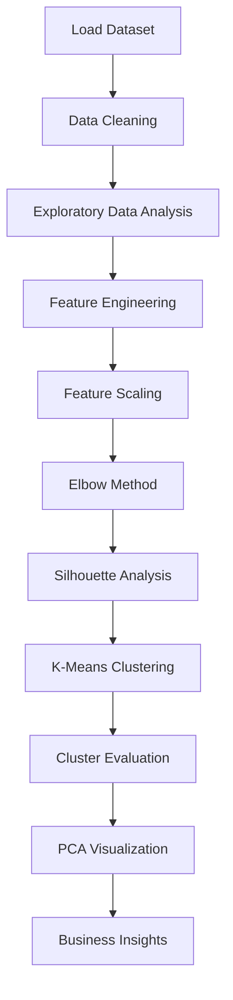

<div align="center">

# 🛍️ Customer Segmentation using K-Means Clustering

### SkillCraft Technology Machine Learning Internship — Task 02

### Machine Learning Project for Customer Segmentation using **K-Means Clustering**, **PCA**, **EDA**, and **Business Insights**

</div>

---

<p align="center">


</p>

---

# 📊 Customer Segmentation


A complete Machine Learning project that segments mall customers into meaningful groups using the **K-Means Clustering** algorithm. The project includes **Exploratory Data Analysis (EDA)**, **Feature Engineering**, **Feature Scaling**, **Cluster Evaluation**, **Principal Component Analysis (PCA)**, and actionable **Business Insights**.

---

# 📌 Table of Contents

- Overview
- Project Objectives
- Dataset
- Technologies Used
- Built With
- Project Workflow
- Exploratory Data Analysis
- Data Preprocessing
- Model Building
- Model Evaluation
- Visualizations
- Business Insights
- Results
- Installation
- Project Structure
- Future Improvements
- Learning Outcomes
- Repository Information
- Author

---

# 📖 Overview

Customer segmentation is one of the most important applications of **Unsupervised Machine Learning**. Instead of predicting values, clustering algorithms identify hidden patterns within customer data and group customers with similar purchasing behavior.

This project applies the **K-Means Clustering Algorithm** to segment mall customers based on:

- Gender
- Age
- Annual Income
- Spending Score

The optimal number of clusters was determined using both the **Elbow Method** and the **Silhouette Score**, ensuring that the resulting customer groups are meaningful and easy to interpret from a business perspective.

---

# 🎯 Project Objectives

- Perform Exploratory Data Analysis (EDA)
- Analyze customer demographics
- Understand purchasing behavior
- Handle data preprocessing
- Perform Feature Engineering
- Apply Feature Scaling using StandardScaler
- Determine the optimal number of clusters
- Train a K-Means Clustering model
- Evaluate clustering quality
- Visualize clusters using PCA
- Generate customer personas
- Provide business recommendations

---

# 📂 Dataset

**Dataset Name:** Mall Customers Dataset

**Source:** https://www.kaggle.com/datasets/vjchoudhary7/customer-segmentation-tutorial-in-python

## Dataset Features

| Feature | Description |
|----------|-------------|
| CustomerID | Unique customer identifier |
| Gender | Male/Female |
| Age | Customer age |
| Annual Income (k$) | Annual income in thousand dollars |
| Spending Score (1–100) | Customer spending score assigned by the mall |

### Dataset Size

- Rows : **200**
- Columns : **5**

---

# 🛠️ Technologies Used

| Category | Tools |
|-----------|-------|
| Programming Language | Python |
| Data Analysis | Pandas, NumPy |
| Visualization | Matplotlib, Seaborn, Plotly |
| Machine Learning | Scikit-Learn |
| Dimensionality Reduction | PCA |
| Notebook | Jupyter Notebook |
| Version Control | Git & GitHub |

---

# 🚀 Built With


---

# 🔄 Project Workflow



---

# 📊 Exploratory Data Analysis

The following analyses were performed:

- Customer age distribution
- Annual income distribution
- Spending score distribution
- Gender distribution
- Correlation heatmap
- Pairplot visualization
- Outlier detection using Boxplots

EDA helps understand the underlying structure of customer behavior before clustering.

---

# ⚙️ Data Preprocessing

The following preprocessing steps were performed:

- Checked missing values
- Verified duplicate records
- Encoded categorical features
- Selected important features
- Standardized numerical variables using **StandardScaler**

Feature Scaling ensures that all variables contribute equally during clustering.

---

# 🤖 Model Building

The project uses the **K-Means Clustering Algorithm**.

### Steps

1. Load dataset
2. Select features
3. Apply StandardScaler
4. Find optimal K using Elbow Method
5. Validate using Silhouette Score
6. Train K-Means model
7. Predict customer clusters
8. Save clustered dataset

---

# 📈 Model Evaluation

| Metric | Value |
|---------|------:|
| Algorithm | K-Means Clustering |
| Optimal Number of Clusters | **5** |
| Silhouette Score | **0.xxx** |
| Davies-Bouldin Index | **x.xxx** |
| Calinski-Harabasz Score | **xxx.xx** |

The optimal number of clusters was selected using both the **Elbow Method** and **Silhouette Analysis**. Although larger values of K slightly improved the silhouette score, **K = 5** provided the best balance between performance and business interpretability.

---

# 📊 Results Summary

| Item | Result |
|------|--------|
| Dataset | Mall Customers |
| Samples | 200 |
| Features | 5 |
| Algorithm | K-Means |
| Optimal Clusters | 5 |
| Scaling | StandardScaler |
| Dimensionality Reduction | PCA |
| Evaluation Metrics | Silhouette + Davies-Bouldin + Calinski-Harabasz |

---

# 📈 Key Results

- Successfully segmented customers into **5 meaningful clusters**
- Applied **StandardScaler** before clustering
- Identified optimal K using Elbow Method
- Evaluated clusters using three performance metrics
- Visualized customer groups using PCA
- Created customer personas for marketing strategies

---

# 📷 Project Visualizations

## Customer Segmentation


---

## Elbow Method


---

## PCA Visualization


---

## Correlation Heatmap


---

## Pairplot


---

## Age Distribution


---

## Annual Income Distribution


---

## Spending Score Distribution


---

# 💼 Business Insights

The clustering model identified several distinct customer groups with different purchasing behaviors.

### Business Recommendations

- 🎯 Offer premium memberships to high-income, high-spending customers.
- 🎁 Introduce loyalty rewards for regular shoppers.
- 📢 Create personalized campaigns for high-income but low-spending customers.
- 🛍️ Offer budget-friendly promotions to low-income segments.
- 📈 Improve marketing efficiency using customer segmentation.
- 💰 Increase customer retention through personalized recommendations.

---

# 🚀 Installation

Clone the repository

```bash
git clone https://github.com/abhijinkiri-create/SCT_ML_Task02_CustomerSegmentation.git
```

Navigate to the project directory

```bash
cd SCT_ML_Task02_CustomerSegmentation
```

Install dependencies

```bash
pip install -r requirements.txt
```

Launch Jupyter Notebook

```bash
jupyter notebook
```

Open

```text
Customer_Segmentation.ipynb
```

---

# 📁 Project Structure

```text
SCT_ML_Task02_CustomerSegmentation
│
├── data/
│   └── Mall_Customers.csv
│
├── images/
│   ├── age_distribution.png
│   ├── annual_income_distribution.png
│   ├── spending_score_distribution.png
│   ├── gender_distribution.png
│   ├── boxplot_age.png
│   ├── boxplot_income.png
│   ├── boxplot_spending.png
│   ├── correlation_heatmap.png
│   ├── pairplot.png
│   ├── elbow_method.png
│   ├── silhouette_score.png
│   ├── customer_clusters.png
│   ├── pca_clusters.png
│
├── Customer_Segmentation.ipynb
├── clustered_customers.csv
├── cluster_profile.csv
├── requirements.txt
├── README.md
├── LICENSE
└── .gitignore
```

---

# 🚀 Future Improvements

- Implement DBSCAN clustering
- Compare with Agglomerative Clustering
- Build an interactive Streamlit Dashboard
- Deploy using Streamlit Cloud
- Add Customer Recommendation System
- Enable Real-Time Customer Segmentation
- Include additional behavioral features
- Compare multiple clustering algorithms

---

# 👨‍💻 Author

## **JINKIRI ABHINAY**

🎓 **B.Tech – Computer Science and Engineering (AI & ML)**

🏫 **Noida International University**

💼 **Machine Learning Intern – SkillCraft Technology**

### 🔗 GitHub

https://github.com/abhijinkiri-create

### 🔗 LinkedIn

https://www.linkedin.com/in/abhinay-jinkiri-302b67324/

---

# ✨ Project Highlights

- ✔️ Data Cleaning
- ✔️ Exploratory Data Analysis
- ✔️ Feature Engineering
- ✔️ Feature Scaling
- ✔️ StandardScaler
- ✔️ Elbow Method
- ✔️ Silhouette Analysis
- ✔️ K-Means Clustering
- ✔️ PCA Visualization
- ✔️ Plotly Interactive Charts
- ✔️ Business Insights
- ✔️ Customer Personas
- ✔️ Cluster Evaluation
- ✔️ Professional Documentation

---

# 📚 Learning Outcomes

During this project, I gained practical experience in:

- Unsupervised Machine Learning
- Customer Segmentation
- Data Cleaning
- Data Visualization
- Exploratory Data Analysis
- Feature Engineering
- StandardScaler
- K-Means Clustering
- PCA
- Cluster Evaluation
- Business Analytics
- Git & GitHub
- Project Documentation

---

# 📌 Repository Information

| Category | Details |
|-----------|---------|
| Internship | SkillCraft Technology |
| Task | Task 02 |
| Domain | Machine Learning |
| Algorithm | K-Means Clustering |
| Project Type | Unsupervised Learning |
| Dataset | Mall Customers |
| Status | ✅ Completed |

---

<div align="center">

## ⭐ Thank You for Visiting This Repository!

If you found this project useful, please consider giving it a **⭐ Star** on GitHub.

This project was developed as part of the **SkillCraft Technology Machine Learning Internship (Task 02)**.

**Happy Learning! 🚀**

</div>
