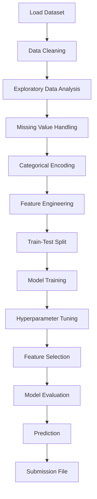

<div align="center">

# 🏠 House Price Prediction using Machine Learning

### SkillCraft Technology Machine Learning Internship — Task 01

### Machine Learning Project for House Price Prediction using **Regression Models**, **EDA**, **Feature Engineering**, **Hyperparameter Tuning**, and **Machine Learning Pipeline**

</div>

---

<p align="center">


</p>

---

# 🏡 House Price Prediction


A complete Machine Learning project that predicts house prices based on property characteristics using **Regression Algorithms**. The project includes **Exploratory Data Analysis (EDA)**, **Feature Engineering**, **Data Preprocessing**, **Hyperparameter Tuning**, **Model Comparison**, **Machine Learning Pipeline**, and **Business Insights**.

---

# 📌 Table of Contents

- Overview
- Project Objectives
- Dataset
- Technologies Used
- Built With
- Project Workflow
- Exploratory Data Analysis
- Data Preprocessing
- Feature Engineering
- Model Building
- Model Evaluation
- Visualizations
- Results
- Business Insights
- Installation
- Project Structure
- Future Improvements
- Learning Outcomes
- Repository Information
- Author

---

# 📖 Overview

House price prediction is one of the most common applications of **Supervised Machine Learning**. By learning patterns from historical housing data, machine learning models can accurately estimate the selling price of houses based on their features.

In this project, multiple regression algorithms are trained and compared using features such as:

- Overall Quality
- Living Area
- Garage Capacity
- Basement Area
- Year Built
- Lot Area
- Neighborhood
- House Style
- Total Rooms
- Location Features

The project follows an end-to-end Machine Learning workflow from **data preprocessing** to **model evaluation**, ensuring reliable and accurate house price predictions.

---

# 🎯 Project Objectives

- Perform Exploratory Data Analysis (EDA)
- Analyze important housing features
- Handle missing values
- Encode categorical variables
- Perform Feature Engineering
- Select important features
- Compare multiple regression algorithms
- Optimize models using Hyperparameter Tuning
- Build a Machine Learning Pipeline
- Evaluate model performance
- Predict house prices for unseen data

---

# 📂 Dataset

**Dataset Name:** House Prices - Advanced Regression Techniques

**Source:** https://www.kaggle.com/competitions/house-prices-advanced-regression-techniques

## Dataset Information

| Item | Value |
|------|------|
| Training Samples | 1460 |
| Testing Samples | 1459 |
| Features | 80 |
| Target Variable | SalePrice |

---

# 🛠 Technologies Used

| Category | Tools |
|-----------|-------|
| Programming Language | Python |
| Data Analysis | Pandas, NumPy |
| Data Visualization | Matplotlib, Seaborn |
| Machine Learning | Scikit-Learn |
| Model Serialization | Joblib |
| Notebook | Jupyter Notebook |
| Version Control | Git & GitHub |

---

# 🚀 Built With


---

# 🔄 Project Workflow



---

# 📊 Exploratory Data Analysis

The following analyses were performed:

- Sale Price Distribution
- Correlation Heatmap
- Missing Value Analysis
- Feature Distribution
- Outlier Detection
- Feature Relationships
- Numerical vs Categorical Analysis

EDA provides valuable insights into the dataset and helps identify influential features affecting house prices.

---

# ⚙️ Data Preprocessing

The preprocessing pipeline includes:

- Handling Missing Values
- Removing Duplicates
- Encoding Categorical Features
- Feature Scaling (where applicable)
- Feature Engineering
- Train-Test Split

These preprocessing steps improve model performance and ensure consistent predictions.

---

# 🧠 Feature Engineering

Several useful features were engineered to improve predictive performance, including:

- Total Living Area
- Total Bathrooms
- House Age
- Total Porch Area
- Overall Property Score

Feature engineering helps models capture more meaningful relationships within the data.

---

# 🤖 Models Used

The following regression algorithms were implemented and compared:

- Linear Regression
- Decision Tree Regressor
- Random Forest Regressor

The best-performing model was selected based on evaluation metrics.

---

# 📊 Model Evaluation

| Metric | Description |
|---------|-------------|
| MAE | Mean Absolute Error |
| MSE | Mean Squared Error |
| RMSE | Root Mean Squared Error |
| R² Score | Coefficient of Determination |

These metrics were used to compare different regression models and select the best-performing model.

---

# 📈 Results Summary

| Item | Result |
|------|--------|
| Dataset | House Prices |
| Training Samples | 1460 |
| Testing Samples | 1459 |
| Features | 80 |
| Target Variable | SalePrice |
| Models Compared | 3 |
| Best Model | Random Forest Regressor *(if applicable)* |
| Pipeline | Scikit-Learn Pipeline |

---

# 📈 Key Results

- Successfully predicted house prices using regression models.
- Built a complete end-to-end Machine Learning pipeline.
- Compared multiple regression algorithms.
- Improved model performance using feature engineering.
- Applied hyperparameter tuning for optimization.
- Generated prediction files for unseen test data.

---

# 📷 Project Visualizations

## House Price Distribution

```text
images/house_price_distribution.png
```

---

## Correlation Heatmap

```text
images/correlation_heatmap.png
```

---

## Missing Values Heatmap

```text
images/missing_values.png
```

---

## Feature Importance

```text
images/feature_importance.png
```

---

## Actual vs Predicted Prices

```text
images/actual_vs_predicted.png
```

---

## Model Comparison

```text
images/model_comparison.png
```

---

# 💼 Business Insights

The predictive model provides valuable insights for the real estate industry.

### Business Recommendations

- 🏡 Estimate property prices accurately.
- 📈 Assist buyers in making informed purchasing decisions.
- 💰 Help sellers determine competitive pricing.
- 🏢 Support real estate agencies with automated valuations.
- 📊 Enable data-driven pricing strategies.
- 🤝 Improve investment decision-making using predictive analytics.

---

# 🚀 Installation

Clone the repository

```bash
git clone https://github.com/abhijinkiri-create/SCT_ML_Task01_HousePricePrediction.git
```

Navigate to the project directory

```bash
cd SCT_ML_Task01_HousePricePrediction
```

Install required libraries

```bash
pip install -r requirements.txt
```

Run the Machine Learning Pipeline

```bash
python src/ml_pipeline.py
```

Generate Predictions

```bash
python src/predict.py
```

---

# 📁 Project Structure

```text
SCT_ML_Task01_HousePricePrediction
│
├── data/
│   ├── train.csv
│   ├── test.csv
│   └── sample_submission.csv
│
├── notebook/
│   └── House_Price_Prediction.ipynb
│
├── images/
│   ├── house_price_distribution.png
│   ├── correlation_heatmap.png
│   ├── missing_values.png
│   ├── feature_importance.png
│   ├── actual_vs_predicted.png
│   ├── model_comparison.png
│
├── src/
│   ├── data_preprocessing.py
│   ├── feature_engineering.py
│   ├── feature_selection.py
│   ├── model.py
│   ├── model_comparison.py
│   ├── hyperparameter_tuning.py
│   ├── ml_pipeline.py
│   └── predict.py
│
├── models/
│   └── house_price_pipeline.pkl
│
├── outputs/
│   ├── submission.csv
│   ├── feature_importance.csv
│   └── model_comparison.csv
│
├── requirements.txt
├── README.md
├── LICENSE
└── .gitignore
```

---

# 🚀 Future Improvements

- Implement XGBoost
- Implement LightGBM
- Implement CatBoost
- Apply Cross-Validation Optimization
- Use SHAP for Model Explainability
- Deploy using FastAPI
- Containerize using Docker
- Track experiments with MLflow
- Build an interactive Streamlit Dashboard
- Deploy on Streamlit Cloud

---

# 👨‍💻 Author

## **JINKIRI ABHINAY**

🎓 **B.Tech – Computer Science and Engineering (AI & ML)**

🏫 **Noida International University**

💼 **Machine Learning Intern – SkillCraft Technology**

### 🔗 GitHub

https://github.com/abhijinkiri-create

### 🔗 LinkedIn

https://www.linkedin.com/in/abhinay-jinkiri-302b67324/

---

# ✨ Project Highlights

- ✔️ Data Cleaning
- ✔️ Exploratory Data Analysis
- ✔️ Missing Value Handling
- ✔️ Feature Engineering
- ✔️ Feature Selection
- ✔️ Regression Models
- ✔️ Hyperparameter Tuning
- ✔️ Model Comparison
- ✔️ Machine Learning Pipeline
- ✔️ Model Evaluation
- ✔️ Prediction System
- ✔️ Professional Documentation

---

# 📚 Learning Outcomes

During this project, I gained practical experience in:

- Supervised Machine Learning
- Regression Analysis
- Data Cleaning
- Data Visualization
- Exploratory Data Analysis
- Feature Engineering
- Feature Selection
- Hyperparameter Tuning
- Machine Learning Pipelines
- Model Evaluation
- Predictive Analytics
- Git & GitHub
- Professional Project Documentation

---

# 📌 Repository Information

| Category | Details |
|-----------|---------|
| Internship | SkillCraft Technology |
| Task | Task 01 |
| Domain | Machine Learning |
| Project Type | Supervised Learning |
| Algorithm | Regression |
| Dataset | House Prices |
| Status | ✅ Completed |

---

<div align="center">

## ⭐ Thank You for Visiting This Repository!

If you found this project useful, please consider giving it a **⭐ Star** on GitHub.

This project was developed as part of the **SkillCraft Technology Machine Learning Internship (Task 01)**.

**Happy Learning! 🚀**

</div>
